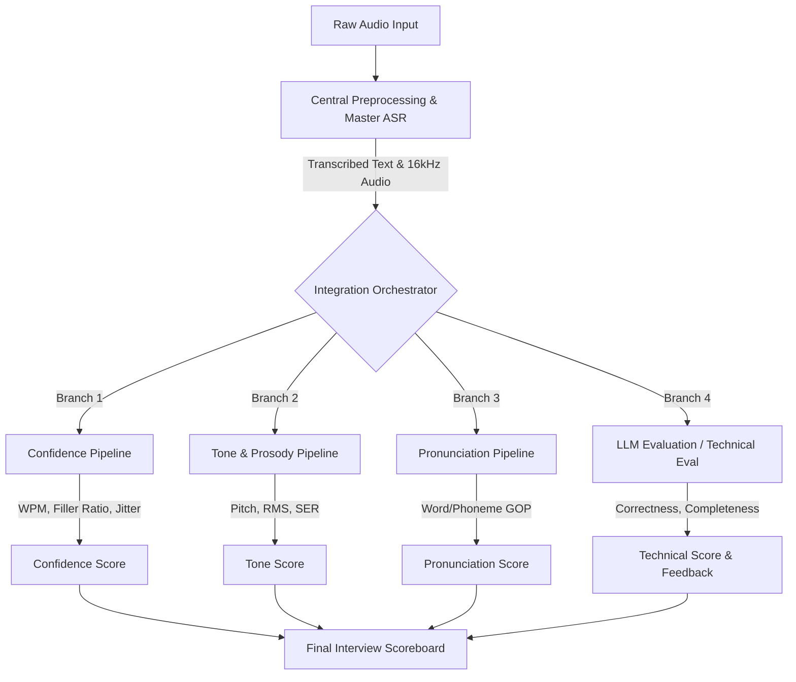

# AI Interview Suite

A comprehensive, privacy-first, multimodal behavioral analysis and AI interview evaluation pipeline. This project analyzes spoken interview answers using advanced Acoustic, Natural Language Processing, and Large Language Models to generate deterministic scores based on human vocal traits, tone, pronunciation, and technical content.

---

##  System Overview

The AI Interview Suite orchestrates multiple distinct analysis pipelines concurrently on a single audio input. It provides a composite "Scoreboard" that comprehensively evaluates a candidate's answer across several dimensions:

1. **Confidence & Behavioral Analysis**: Evaluates fluency, pacing, micro-tremors, and linguistic certainty using a 40/40/20 rubric.
2. **Tone & Prosody**: Analyzes pitch variation, volume energy dynamics, and emotion via Speech Emotion Recognition (SER).
3. **Pronunciation**: Performs industry-standard phoneme-level Goodness of Pronunciation (GOP) scoring using Montreal Forced Aligner (MFA).
4. **LLM Evaluation**: High-throughput inference for grading grammar, content, and semantic relevance using vLLM, Celery, and Redis.
5. **Technical Evaluation**: A strict LLM-based technical assessment engine to evaluate conceptual correctness, coverage, and depth of reasoning against ground-truth expected answers.
6. **Master ASR (STT)**: A centralized Speech-to-Text module wrapping Whisper/WhisperX for ultra-fast, offline transcription with word-level timestamps.

---

## Architecture

The system is designed to take raw audio (e.g., from a browser), preprocess it, and run it concurrently through multiple specialized evaluation branches.



---

##  Repository Structure & Modules in Minute Detail

The project is highly modularized. Each directory handles a specific aspect of the AI analysis:

### 1. `confidence/` (Behavioral & Fluency Pipeline)
Generates a deterministic confidence score using a strict **40/40/20 Rubric** (Fluency/Stability/Certainty).
- **Fluency (40%)**: Calculates Words Per Minute (WPM), Filler Word Ratio (e.g., "um", "uh"), and Unvoiced Pauses.
- **Stability (40%)**: Analyzes vocal cord jitter (Voice Tremor) and shimmer (Volume Wavering) using OpenSMILE features.
- **Certainty (20%)**: Computes Hedge Word Ratio ("I think", "maybe") via spaCy NLP models.

### 2. `tone/` (Prosody & Emotion Pipeline)
Extracts prosody metrics to evaluate voice expression, enthusiasm, and overall vocal tone.
- **Pitch**: Measures the fundamental frequency (F0) contour via Parselmouth/Praat to detect monotony versus dynamic pitch.
- **Energy**: Calculates RMS amplitude variance via Librosa to measure volume dynamics.
- **Emotion (SER)**: Speech Emotion Recognition utilizing SpeechBrain Wav2Vec2 models to classify the emotional state of the speaker.

### 3. `Pronunciation/` (Acoustic Evaluation Pipeline)
An industry-standard pronunciation assessment system.
- Converts raw audio into actual phonemes using Wav2Vec2.
- Generates expected phonemes via Grapheme-to-Phoneme (G2P) from the Whisper ASR transcribed text.
- Uses **Montreal Forced Aligner (MFA)** to align the actual and expected sequences.
- Calculates **Goodness of Pronunciation (GOP)** at both the phoneme and word levels.

### 4. `LLM_eval/` (High-Throughput Language Evaluation)
A robust engine for async, batch-processed text evaluations.
- Features API abstraction (`api_llm`), batch processing pipelines (`batching`), and task queue workers (`workers`).
- Leverages **vLLM** for local inferencing of quantized models, and supports cloud APIs (OpenAI) via `.env` configuration.
- Queues jobs using **Celery + Redis**, making it highly scalable and capable of handling high throughput without blocking the main event loop.

### 5. `technical_eval/` (Strict Technical Assessor)
A specialized LLM agent explicitly instructed to function as a strict technical interviewer.
Evaluates answers based on exactly 6 parameters:
- **Conceptual Correctness (28%)**: Are the technical facts true compared to the expected answer?
- **Concept Coverage (20%)**: What fraction of expected concepts were meaningfully explained?
- **Depth of Reasoning (18%)**: Does the candidate explain the *why* and *how* (tradeoffs, edge cases)?
- **Completeness (12%)**: Was every part of the question addressed?
- **Structure Clarity (10%)**: Is the answer organized logically?
- **Domain Relevance (12%)**: Does the answer stay grounded in the correct technical field?
- Includes a **Hallucination Flag** that caps the score heavily if confident falsehoods are detected.

### 6. `STT/` (Master ASR Stage)
Centralized Speech-to-Text module.
- Wraps `whisper` and `whisperx` algorithms for high-precision, offline transcription.
- Performs word-level alignment, generating the foundational text transcript consumed by all other downstream pipelines (Confidence, LLM, Pronunciation).

### 7. `core_main/` & `integration/`
The orchestrator components.
- **`core_main/registry.py`**: Safe-loading utilities and memory caching for large models to prevent redundant loading.
- **`integration/main.py`**: The master integration script that initializes the pipelines concurrently and merges the results into a final CLI scoreboard.

---

##  Installation & Setup

Ensure you have **Python 3.10+** installed. (Tested on Windows & Linux)

### 1. Virtual Environment & Python Dependencies
```bash
# Create the virtual environment
python -m venv .venv

# Activate environment (Windows)
.venv\Scripts\activate
# OR Activate environment (macOS/Linux)
# source .venv/bin/activate

# Install all core project dependencies
pip install -r requirements.txt
pip install -r api_requirements.txt
```

### 2. Download Base NLP Models
```bash
# Download the spaCy English model required for Hedge Word calculation
python -m spacy download en_core_web_sm
```
*(Note: Whisper, SpeechBrain, and HuggingFace Wav2Vec2 models will auto-download into their respective cache directories upon first run.)*

### 3. Configure Environment
Copy `.env` and fill in your values:
```bash
cp .env .env.local   # or edit .env directly
```
Key variables to set before running:
| Variable | Default | Description |
|---|---|---|
| `APP_ENV` | `dev` | `dev` or `prod`. Controls LLM backend, validation strictness, and logging. |
| `REDIS_URL` | `redis://localhost:6379/0` | URL for the Redis broker. |
| `LLM_BACKEND` | `ollama` | `ollama`, `vllm`, or `openai`. |
| `OLLAMA_MODEL` | `qwen2.5:0.5b-instruct` | Ollama model name (dev mode). |
| `CORS_ORIGINS` | `*` | Comma-separated allowed origins. **Must be restricted in production.** |
| `API_KEY` | `default-dev-key` | Secret key required in the `X-API-Key` header to access core endpoints. |
| `UPLOAD_MAX_AGE_S` | `3600` | Files in `uploads/` older than this (seconds) are auto-deleted. |
| `UPLOAD_CLEANUP_INTERVAL_S` | `300` | How often (seconds) the cleanup sweep runs. |
| `METRICS_POLL_INTERVAL_S` | `15` | How often the background metrics polling loop runs. |
| `WARN_QUEUE_DEPTH` | `50` | Threshold to log a warning if a Celery queue gets too deep. |
| `WARN_ACTIVE_TASKS` | `20` | Threshold to log a warning if total active tasks are too high. |

---

##  How to Run the Project (API + Workers)

The system requires **three processes** running simultaneously: Redis, the FastAPI server, and the Celery worker.

### Step 1 — Start Redis
Make sure a Redis server is running locally (or use Docker):
```bash
# Using Docker (recommended)
docker run -d -p 6379:6379 redis:7.2-alpine

# OR, if Redis is installed locally
redis-server
```

### Step 2 — Start the Celery Worker
The worker processes all evaluation tasks in the background. Open a new terminal:

```bash
# Activate your virtual environment first
.venv\Scripts\activate  # Windows
# source .venv/bin/activate  # Linux/macOS

# Start the worker (listens on all three queues)
celery -A api.workers.celery_app worker \
  --queues=evaluate,batch,celery \
  --concurrency=2 \
  --loglevel=info
```

> **Windows note**: Celery on Windows does not support `prefork`. The app auto-detects this and uses the `solo` pool. If you encounter issues, add `--pool=solo` to the command above.

**Using the provided batch script (Windows only):**
```bat
start_worker.bat
```

### Step 3 — Start the FastAPI Server (uvicorn)
In another terminal:

```bash
# Activate your virtual environment first
.venv\Scripts\activate

# Development (with hot-reload)
uvicorn api.main:app --reload --host 0.0.0.0 --port 8000

# Production (without reload, multi-worker via Gunicorn)
gunicorn api.main:app \
  -k uvicorn.workers.UvicornWorker \
  -w 2 \
  --bind 0.0.0.0:8000
```

**Using the provided batch script (Windows only):**
```bat
start_api.bat
```

### Step 4 — Verify Everything Is Running
```bash
# Check liveness (should return {"status":"ok"})
curl http://localhost:8000/health/live

# Check readiness (confirms Redis + at least 1 worker is connected)
curl http://localhost:8000/health/ready
```

### Run with Docker Compose (all-in-one)
```bash
# Start all services (Redis + API + Worker)
docker-compose up --build

# With Flower monitoring UI (optional)
docker-compose --profile monitoring up --build
```

---

##  Execution Commands (CLI — without API)

You can also run the entire combined analysis suite directly from the command line:

### 1. Run evaluation for speaking
Evaluates confidence, tone, pronunciation, and LLM eval at once:
```bash
python final_integration/main.py speaking /audio/path --topic "Tell us about yourself" --reference-text "Reference text"
```

### 2. Run evaluation for writing
Runs LLM eval:
```bash
python final_integration/main.py writing --topic "Tell us about yourself" --text-file /path/to/textfile.txt
```

### 3. Run evaluation for behavioral
Evaluates confidence, tone, and LLM eval:
```bash
python final_integration/main.py behavioral /audio/path --topic "Tell us about yourself"
```

### 4. Run technical evaluation
Semantic eval and LLM eval:
```bash
python final_integration/main.py technical /audio/path --topic --question-json /path/to/question.json
```

Example `question.json`:
```json
{
  "q_id": "TI-CF-001",
  "role_family": "CS Fundamentals",
  "topic": "Data Structures",
  "level_band": "Foundational",
  "level_range": "L1-L18",
  "est_minutes": 8,
  "question": "What is the difference between synchronous and asynchronous programming?",
  "model_answer": "Synchronous programming executes tasks sequentially, blocking the thread until each task completes. Asynchronous programming allows tasks to run concurrently without blocking the main thread.",
  "evaluation_rubric": "Mentions sequential vs concurrent; correct explanation of blocking; names a mechanism (callbacks, promises, async/await).",
  "follow_up": "Can you give an example of a situation where asynchronous programming is preferred?",
  "red_flags": "Confuses asynchronous with multithreading."
}
```

---

##  API Reference

The FastAPI server exposes the following REST and WebSocket endpoints. When the server is running, you can explore all endpoints interactively at:

| Interface | URL |
|---|---|
| **Swagger UI** (interactive docs) | `http://localhost:8000/docs` |
| **ReDoc** (clean reference docs) | `http://localhost:8000/redoc` |
| **OpenAPI JSON schema** | `http://localhost:8000/openapi.json` |

---

###  Authentication (API Key)

All core evaluation endpoints (`/evaluate/*`, `/sessions/*`, `/ws/*`) are protected and require authentication. 
Health checks (`/health/*`), Prometheus metrics (`/metrics`), and API documentation bypass authentication for ease of infrastructure monitoring.

To authenticate, pass your configured `API_KEY` in the HTTP headers:
```http
X-API-Key: your-super-secret-production-key-here
```
*(In the Swagger UI at `/docs`, you can click the "Authorize" padlock at the top right to inject this header automatically).*

---

###  Docs & Root

#### `GET /`
Root endpoint. Returns service name, version, and links to docs and health.

**Response:**
```json
{
  "service": "AI-Interview Evaluation API",
  "version": "1.0.0",
  "docs": "/docs",
  "health": "/health/live"
}
```

---

###  Evaluate Endpoints (`/evaluate`)

All evaluation endpoints are asynchronous. Submitting a job immediately returns a `session_id`. You then poll `/evaluate/status/{session_id}` or connect via WebSocket to receive the result.

---

#### `POST /evaluate/submit`
Submit a new evaluation job. Accepts a `multipart/form-data` request.

**Form Fields:**
| Field | Type | Required | Description |
|---|---|---|---|
| `task_type` | `string` |  | `speaking`, `writing`, `behavioral`, or `technical` |
| `topic` | `string` |  | The question or prompt the candidate is answering |
| `audio` | `file` |  | Audio file (`.wav`, `.mp3`, `.m4a`, `.flac`, `.ogg`, `.webm`). Required for all except `writing`. For `technical` tasks, this represents the main answer. |
| `followup_audio` | `file` | — | Second audio file containing the answer to the follow-up question. (Used in `technical` tasks only). |
| `text` | `string` | — | Pre-supplied transcript or essay text. Used for `writing` tasks. |
| `reference_text` | `string` | — | Correct reference text for pronunciation scoring (`speaking` tasks). |
| `questions_json` | `string` |  | JSON string matching the technical question schema (`q_id`, `role_family`, `topic`, `model_answer`, `evaluation_rubric`, etc.). Required for `technical` tasks. |
| `session_id` | `string` | — | Optionally provide a pre-created session ID. |

**Response `202 Accepted`:**
```json
{
  "session_id": "550e8400-e29b-41d4-a716-446655440000",
  "celery_task_id": "a1b2c3d4-...",
  "status": "QUEUED",
  "queue": "evaluate"
}
```

---

#### `GET /evaluate/status/{session_id}`
Poll the status of an evaluation job. Checks Redis cache first, then falls back to Celery `AsyncResult`.

**Path Parameter:** `session_id` — the UUID returned by `/evaluate/submit`.

**Response `200 OK`:**
```json
{
  "session_id": "550e8400-...",
  "celery_task_id": "a1b2c3d4-...",
  "status": "SUCCESS",
  "result": { ... },
  "error": null,
  "created_at": 1718600000.0,
  "updated_at": 1718600045.0,
  "overall_score": 82.5
}
```

**Possible `status` values:** `QUEUED`, `STARTED`, `SUCCESS`, `FAILURE`, `CANCELLED`

---

#### `GET /evaluate/result/{session_id}`
Fetch the full scored result for a completed job. Returns `404` if not ready or if the Redis cache has expired (`RESULT_TTL`).

**Response `200 OK`:**
```json
{
  "session_id": "550e8400-...",
  "task_type": "speaking_evaluation",
  "transcript": "I am a software engineer with 5 years of experience...",
  "confidence": { "score": 78.2, "wpm": 145, "filler_ratio": 0.03 },
  "tone": { "score": 85.0, "pitch_variability": "high", "emotion": "confident" },
  "pronunciation": { "score": 90.1, "word_scores": { ... } },
  "llm_eval": { "score": 80.0, "grammar": "good", "relevance": "high" },
  "semantic_eval": null,
  "llm_score": 80.0,
  "overall_score": 83.3,
  "errors": {},
  "total_latency_ms": 4821.3,
  "cached_at": 1718600045.0
}
```

---

#### `DELETE /evaluate/cancel/{session_id}`
Revoke a pending or running evaluation task and mark it as `CANCELLED`. Sends `SIGTERM` to the Celery worker.

**Response `200 OK`:**
```json
{
  "session_id": "550e8400-...",
  "status": "CANCELLED",
  "celery_task_id": "a1b2c3d4-..."
}
```

---

#### `POST /evaluate/batch`
Fan out multiple audio files in a single request. Each file becomes an independent evaluation task. All files are saved concurrently (no sequential blocking).

**Form Fields:**
| Field | Type | Required | Description |
|---|---|---|---|
| `task_type` | `string` |  | Same as `/evaluate/submit` |
| `topic` | `string` |  | Applied to all units in the batch |
| `audios` | `file[]` |  | One or more audio files |
| `questions_json` | `string` | — | JSON **array** — one question object per audio file |

**Response `202 Accepted`:**
```json
{
  "batch_id": "batch_a1b2c3d4e5f6",
  "session_ids": ["uuid-1", "uuid-2", "uuid-3"],
  "total": 3,
  "status": "QUEUED"
}
```

---

#### `GET /evaluate/batch/{batch_id}`
Get the aggregated status for all units in a batch. Uses live Celery `AsyncResult` lookups to avoid stale Redis state.

**Response `200 OK`:**
```json
{
  "batch_id": "batch_a1b2c3d4e5f6",
  "total": 3,
  "completed": 2,
  "failed": 0,
  "completion_pct": 66.7,
  "units": [
    { "session_id": "uuid-1", "status": "SUCCESS", "overall_score": 82.5, "error": null },
    { "session_id": "uuid-2", "status": "SUCCESS", "overall_score": 78.1, "error": null },
    { "session_id": "uuid-3", "status": "STARTED", "overall_score": null, "error": null }
  ]
}
```

---

### Session Endpoints (`/sessions`)

Pre-create and manage session metadata independently of audio submission. Useful for attaching user IDs or context before submitting audio.

---

#### `POST /sessions/create`
Explicitly create a session with optional metadata.

**Request Body (JSON):**
```json
{
  "user_id": "user_abc123",
  "task_type": "speaking",
  "context": { "interview_round": 2, "position": "Backend Engineer" },
  "ttl": 7200
}
```

**Response `201 Created`:**
```json
{
  "session_id": "550e8400-...",
  "created_at": 1718600000.0,
  "ttl": 7200
}
```

---

#### `GET /sessions/{session_id}`
Retrieve all metadata for an existing session, including status, user context, and TTL remaining.

**Response `200 OK`:**
```json
{
  "session_id": "550e8400-...",
  "created_at": 1718600000.0,
  "updated_at": 1718600045.0,
  "task_type": "speaking_evaluation",
  "user_id": "user_abc123",
  "context": { "interview_round": 2 },
  "status": "SUCCESS",
  "celery_task_id": "a1b2c3d4-...",
  "batch_id": null,
  "ttl_remaining": 3512
}
```

---

#### `DELETE /sessions/{session_id}`
Delete a session and its cached result from Redis.

**Response `200 OK`:**
```json
{
  "session_id": "550e8400-...",
  "deleted": true
}
```

---

###  Health Endpoints (`/health`)

Used by load balancers, Kubernetes probes, and monitoring systems.

---

#### `GET /health/live`
**Liveness probe.** Always returns `200 OK` if the FastAPI process is alive. No external dependencies checked.

**Response `200 OK`:**
```json
{
  "status": "ok",
  "timestamp": "2024-06-17T10:30:00.000+00:00"
}
```

---

#### `GET /health/ready`
**Readiness probe.** Checks that Redis is reachable and at least one Celery worker is active. Returns `503` if either condition fails.

**Response `200 OK` (ready) or `503 Service Unavailable` (degraded):**
```json
{
  "status": "ready",
  "redis": true,
  "celery_workers": 2,
  "timestamp": "2024-06-17T10:30:00.000+00:00"
}
```

**Possible `status` values:** `ready`, `degraded` (Redis OK but no workers), `unavailable` (Redis down)

---

#### `GET /health/workers`
Returns detailed information about active Celery workers, queue depths, and reserved tasks.

**Response `200 OK`:**
```json
{
  "active_workers": 2,
  "worker_names": ["celery@worker1", "celery@worker2"],
  "queues": [
    { "name": "evaluate", "depth": 5 },
    { "name": "batch", "depth": 0 },
    { "name": "celery", "depth": 1 }
  ],
  "reserved_tasks": 3
}
```

---

#### `GET /health/hardware`
Returns the auto-detected hardware profile the server was started with. Useful for verifying GPU detection and worker sizing.

**Response `200 OK`:**
```json
{
  "platform": "Linux-5.15...",
  "cpu_cores": 8,
  "gpu_count": 1,
  "gpu_names": ["NVIDIA GeForce RTX 3080"],
  "vram_gb": [10.0],
  "worker_count": 2,
  "batch_size": 4,
  "whisper_model": "small",
  "app_env": "prod",
  "redis_url": "redis://redis:6379/0"
}
```

---

###  WebSocket Endpoint

#### `WS /ws/status/{session_id}`
Stream real-time status updates for a session. The server polls Redis every `WS_POLL_INTERVAL` seconds and pushes a message whenever the status changes. The connection closes automatically when the job reaches a terminal state (`SUCCESS`, `FAILURE`, `CANCELLED`).

**Connect:** `ws://localhost:8000/ws/status/{session_id}`

**Messages pushed by the server:**

Status change message:
```json
{
  "session_id": "550e8400-...",
  "status": "STARTED",
  "overall_score": null,
  "error": null,
  "timestamp": 1718600010.0
}
```

Final result message (on `SUCCESS`):
```json
{
  "session_id": "550e8400-...",
  "status": "RESULT",
  "result": { ... },
  "timestamp": 1718600045.0
}
```

**Client can send:** `"ping"` to keep the connection alive, or `"close"` / `"disconnect"` to terminate it.

---

###  Metrics (Prometheus)

The API exposes standard Prometheus metrics for infrastructure scraping.

#### `GET /metrics`
Returns raw Prometheus text-format metrics. Includes automatic HTTP instrumentation (request counts, latency histograms, error rates) and custom queue capacity gauges.

**Key Custom Metrics:**
- `ai_interview_queue_depth{queue="evaluate|batch|celery"}`: Current number of pending tasks waiting in Redis.
- `ai_interview_active_tasks_total`: Total tasks currently executing across all workers.
- `ai_interview_active_workers`: Live Celery worker processes.
- `ai_interview_build_info`: Static environment and version labels.

*(Note: If you run `docker-compose --profile monitoring up`, a Grafana dashboard will automatically spin up on port 3000 pre-configured to scrape this endpoint).*

---

##  Configuration Details

- **Global Execution Configs**: Device selection (CPU vs GPU via CUDA) and internal batch sizes are dynamically configurable via dataclasses inside `Pronunciation/config_pron/config.py` and `LLM_eval/config_llm/`.
- **LLM Dev/Prod Modes**: You can switch between local quantized models (vLLM/Ollama) and cloud APIs (OpenAI) by modifying `LLM_BACKEND` in `.env`. In `prod` mode, the system automatically selects larger models when sufficient VRAM is detected.
- **Temporary File Handling**: The system natively standardizes any incoming audio codec (MP3/M4A/WAV) to a **16kHz mono WAV** format required by the acoustic models. The Celery worker deletes the local audio file after successful processing. Additionally, a **background cleanup task** sweeps the `uploads/` directory every `UPLOAD_CLEANUP_INTERVAL_S` seconds and removes any file older than `UPLOAD_MAX_AGE_S` seconds, preventing disk bloat from interrupted or failed jobs.
