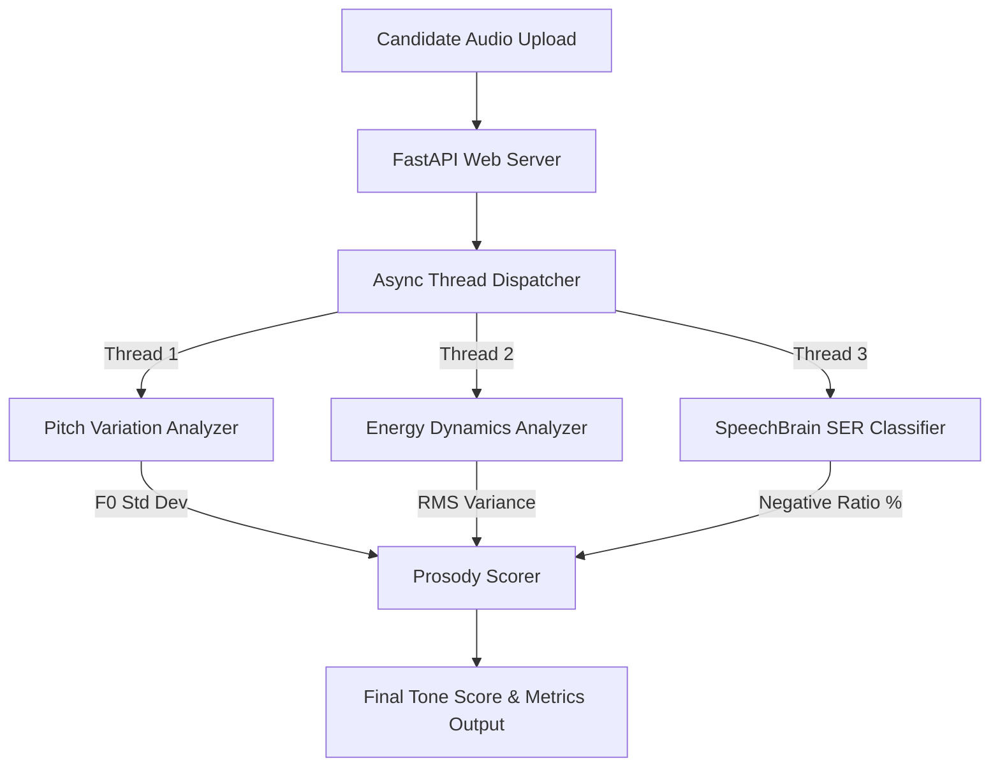

# Tone & Prosody Analysis Pipeline

A FastAPI-based web service that performs real-time vocal analysis on candidate audio. The pipeline extracts and evaluates key prosody metrics—**Pitch Variation**, **Volume Energy Dynamics**, and **Speech Emotion Recognition (SER)**—to calculate an overall tone score and generate personalized, value-driven feedback.

---

## 🏗️ Architecture & Features

The system executes a concurrent three-pronged analysis using Python's asynchronous thread pooling:



*   **Pitch Variation Analyzer (Parselmouth/Praat):** Extracts the fundamental frequency (F0) contour of the speaker and calculates the pitch standard deviation (variation in Hz) to evaluate voice expression.
*   **Energy Dynamics Analyzer (Librosa):** Computes Root-Mean-Square (RMS) amplitude variance across audio frames to measure volume contrast and vocal enthusiasm.
*   **Speech Emotion Recognition (SpeechBrain IEMOCAP):** Uses a pre-trained `Wav2Vec2` model over 3-second sliding windows with a **confidence gate (55%)** to classify emotional states (Neutral, Positive, Negative) and calculate negative-emotion ratios.
*   **Prosody Scorer:** Computes a composite **Tone Score (0-100)** incorporating deductions and bonuses for pitch, energy, and emotion variation.
*   **Value-Driven Feedback:** Generates dynamic, audio-specific feedback that incorporates the actual measured metrics (Hz and RMS values).

---

##  Project Directory Structure

```text
tone_prosody_pipeline/
├── app/
│   ├── api/
│   │   └── routes.py              # FastAPI endpoint routing
│   ├── services/
│   │   ├── emotion_service.py     # SpeechBrain emotion sliding-window analyzer
│   │   ├── energy_service.py      # Librosa energy dynamics analyzer
│   │   ├── pitch_service.py       # Parselmouth pitch variation analyzer
│   │   └── tone_service.py        # Orchestrates analyzers, scores, & builds feedback
│   ├── utils/
│   │   └── logger.py              # Unicode-safe logging configuration
│   ├── config.py                  # Directory configuration paths
│   └── main.py                    # FastAPI application startup
├── pretrained_models/
│   └── emotion_model/             # Local SpeechBrain model checkpoints & scripts
├── requirements.txt               # Project dependency package list
└── README.md                      # Project documentation
```

---

##  Installation & Local Setup

### 1. Prerequisites
Ensure you have **Python 3.10** installed.

### 2. Clone the Repository
```bash
git clone <your-repository-url>
cd tone_prosody_pipeline
```

### 3. Activate the Virtual Environment
Activate your existing virtual environment:
*   **Windows Powershell:**
    ```powershell
    venv\Scripts\Activate.ps1
    ```
*   **macOS/Linux:**
    ```bash
    source venv/bin/activate
    ```

### 4. Install Dependencies
```bash
pip install -r requirements.txt
```

---

## 🖥️ Running the Application

Start the FastAPI application using `uvicorn`:
```bash
python -m uvicorn app.main:app --host 127.0.0.1 --port 8005 --reload
```
The server will initialize, load the SpeechBrain SER model directly into RAM, and run at `http://127.0.0.1:8005`.

---

##  Testing the API

### 1. Interactive Swagger Docs (Recommended)
Open your web browser and go to:
[http://127.0.0.1:8005/docs](http://127.0.0.1:8005/docs)
*   Find the `POST /analyze/tone` endpoint.
*   Click **Try it out**.
*   Upload an audio file (e.g. `.wav` or `.flac`) and click **Execute**.

### 2. Run Local Python Tests
You can run automated test scripts directly from the root workspace:
```bash
python tests/test_pitch.py
python tests/test_emotion.py
```

---

##  Scoring Logic Details

The final **Tone Score (0-100)** is calculated as follows:

1.  **Base Score:** Starts at `100` points.
2.  **Pitch Variation ($pv$ in Hz):**
    *   $pv < 30.0$ Hz (Monotone): **$-20$ points**
    *   $30.0 \le pv < 50.0$ Hz (Below average): **$-10$ points**
    *   $pv \ge 100.0$ Hz (Highly expressive): **$+5$ points** (Bonus)
3.  **Volume Energy Variation ($ev$ in RMS amplitude standard deviation):**
    *   $ev < 0.05$ (Flat volume dynamics): **$-15$ points**
    *   $0.05 \le ev < 0.10$ (Moderate volume dynamics): **$-8$ points**
    *   $ev \ge 0.20$ (Excellent volume dynamics): **$+5$ points** (Bonus)
4.  **Emotional Positivity / Negativity:**
    *   If Negative Ratio $> 60\%$ (Confidently sad/angry): **$-20$ points**
    *   If dominant emotion is `"neutral"`: **$-8$ points** (slightly less engaging than positive)

---

## 🛡️ Robustness & Production Features

*   **Thread Safety & Locks:** Since audio extraction involves CPU-heavy tasks, processing is routed to Python threadpools using `asyncio.to_thread` to ensure the FastAPI loop remains fully responsive.
*   **Exception Safety:** Individual analyzer failures (due to zero-byte files, corrupt audio formats, or missing data) are caught gracefully. The pipeline returns safe fallback values (0s) and does not crash the request thread.
*   **File Handling Cleanup:** Temporary uploaded files are stored safely and removed in a `finally` block with file-lock warning guards, avoiding Windows `PermissionError` conflicts.
